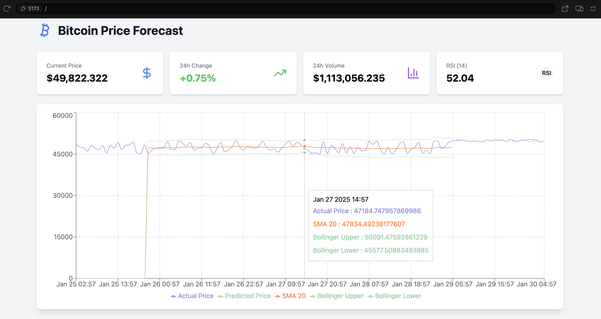

# Cryptocurrency Price Forecasting Dashboard

A fully-featured, **React & TypeScript** web application for visualizing and forecasting cryptocurrency prices. This project includes interactive charts, real-time technical indicators, and mock price prediction functionality. It can easily be extended to fetch real data from the [Alpha Vantage API](https://www.alphavantage.co/).


1/29/2025

---

## Table of Contents

1. [Features](#features)  
2. [Tech Stack](#tech-stack)  
3. [Getting Started](#getting-started)  
   - [Prerequisites](#prerequisites)  
   - [Installation](#installation)  
   - [Running the App](#running-the-app)  
4. [Project Structure](#project-structure)  
5. [Using Real Data](#using-real-data)  
6. [Contributing](#contributing)  
7. [License](#license)  

---

## Features

- **Interactive Price Chart**  
  - Historical data visualization  
  - Technical indicators (SMA-20, RSI, Bollinger Bands)  
  - Price predictions overlay  
  - Zoom and pan capabilities  

- **Key Statistics Display**  
  - Current price  
  - 24-hour price change  
  - 24-hour trading volume  
  - RSI indicator  

- **Technical Analysis Tools**  
  - Simple Moving Average (SMA)  
  - Relative Strength Index (RSI)  
  - Bollinger Bands  

- **Modern UI & UX**  
  - Responsive design using Tailwind CSS  
  - Beautiful icons via Lucide React  
  - Clean, professional styling  
  - Loading states for data fetch  

- **Easy to Extend**  
  - Written in TypeScript for better maintainability  
  - Ready to integrate with any data provider  
  - Well-structured code for computing technical indicators  

---

## Tech Stack

- **React** + **TypeScript**  
- **Recharts** for charts and data visualization  
- **Tailwind CSS** for styling  
- **Lucide React** for icons and UI assets  
- **Alpha Vantage API** (Optional) for cryptocurrency data  

---

## Getting Started

### Prerequisites

- **Node.js** (v14 or above recommended)  
- **NPM** or **Yarn** installed globally  

### Installation

1. **Clone this repository**:
   ```bash
   git clone https://github.com/your-username/crypto-forecast.git
   cd crypto-forecast

2. **Install dependencies**:
   ```bash
   npm install

### Running the App

- ### Development mode:
  ```bash
  npm run dev
  ```
  or
  ```bash
  yarn dev
  ```
- ### Production build:
  ```bash
  npm run build
  ```
  or
  ```bash
  yarn build
  ```
  
---

## Proejct Structure

Below is a simplified view of the project7s folder structure

```csharp
crypto-forecast/
├── node_modules/
├── package.json
├── package-lock.json or yarn.lock
├── src/
│   ├── App.tsx
│   ├── types.ts
│   ├── utils/
│   │   └── indicators.ts
│   ├── components/
│   │   ├── PriceChart.tsx
│   │   └── CryptoStats.tsx
│   └── ...
├── public/
├── tailwind.config.js
├── tsconfig.json
└── ...
```
- **App.tsx**: Main application component
- **types.ts**: TypeScript definitions for data structures
- **utils/indicators.ts**: Core logic for calculating technical indicators
- **components/**: Reusable UI components like charts and stats
- **public/**: Static assets (favicon, images, etc.)

---
## Using Real Data

By default, this project uses **mock data** for demonstration purposes. To fetch real-time cryptocurrency data from [Alpha Vantage](https://www.alphavantage.co/), follow these steps:

1. **Sign up for Alpha Vantage**  
   Register at [Alpha Vantage](https://www.alphavantage.co/) to obtain a free API key.

2. **Set Your API Key**  
   - In your code, replace the placeholder `ALPHA_VANTAGE_API_KEY` with your actual key.  
   - Alternatively, you can store your key as an environment variable and reference it in your fetching logic.

3. **Fetch Real Data**  
   - In the `fetchData` (or equivalent) function, replace the mock data with `fetch` or `axios` calls to Alpha Vantage.  
   - Parse the JSON response and update your chart and stats accordingly.

---

## Contributing

Contributions, issues, and feature requests are welcome! Feel free to check the [issues page](https://github.com/your-username/crypto-forecast/issues) if you have any suggestions or problems.

1. **Fork** the project  
2. **Create a new branch** (`git checkout -b feature/my-feature`)  
3. **Commit your changes** (`git commit -m 'Add some feature'`)  
4. **Push to the branch** (`git push origin feature/my-feature`)  
5. **Open a Pull Request**

---

## License

This project is licensed under the [MIT License](./LICENSE). Feel free to use and modify it to fit your needs.

> **Disclaimer**: This application is for educational and demonstration purposes. Cryptocurrency prices and technical analysis are highly speculative. Always do your own research and consider risks before making any financial decisions.
